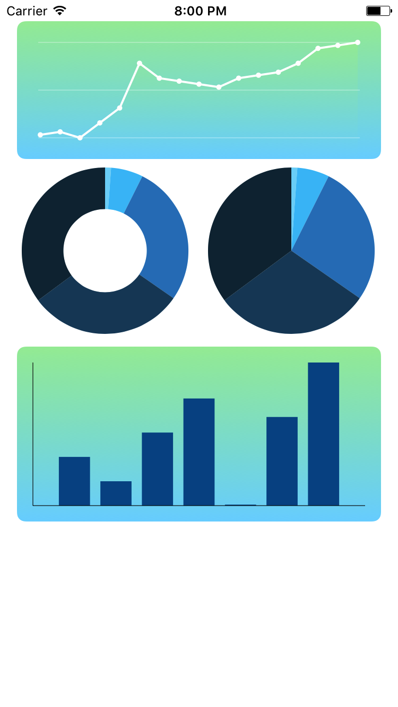

# SwiftCharts

Simple framework to draw customizable charts for iOS.

## Using
#### First of all - Import module
Import SwiftCharts module on your ViewController
``` swift
import SwiftCharts
```


#### Charts
Create a UIView on storyboard and set it`s class module to **SwiftCharts** and class to one of these listed below:
##### DiscreteLineChartView
Create reference
```swift
@IBOutlet weak var discreteLineChart: DiscreteLineChartView!
```
Updating data:
```swift
discreteLineChart.setChartData(data: [1, 2, 0, 5])
```
##### DonutChartView
Create reference
```swift
@IBOutlet weak var donutChartView: DonutChartView!
```
Updating data:
```swift
var chartData:[DonutChartData] = []
chartData.append(DonutChartData(label: "Label1", value: 100, color: UIColor.red))
chartData.append(DonutChartData(label: "Label2", value: 200, color: UIColor.blue))
donutChartView.setChartData(chartData: chartData)
```
##### PieChartView
Create reference
```swift
@IBOutlet weak var pieChartView: PieChartView!
```
Updating data:
```swift
var pieChartData:[DonutChartData] = []
pieChartData.append(DonutChartData(label: "Label1", value: 100, color: UIColor.red))
pieChartData.append(DonutChartData(label: "Label2", value: 200, color: UIColor.blue))
pieChartView.setChartData(chartData: pieChartData)
```

##### Basic example

<br />

## Up next (todo)
- Bar chart.
- Continous line chart.
- Animation for charts.
- Transparent charts.
- Add more information on charts (labels, values, etc...).
- Add event listener on charts.
- Tests.
- Tests.
- More tests.

## Contribution
Feel free to open [issues](https://github.com/WagnerUmezaki/SwiftCharts/issues) for report bugs, discuss some ideas or anything to make this a good framework. :)
## Lisence
MIT

